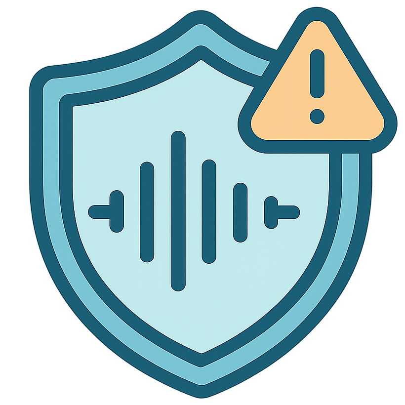

# [](https://de-antifake.github.io/) De-AntiFake: Rethinking the Protective Perturbations Against Voice Cloning Attacks

[![Project Page](https://img.shields.io/static/v1?label=&message=Project%20Page&color=blue&labelColor=555&logo=data:image/png;base64,iVBORw0KGgoAAAANSUhEUgAAABQAAAAUCAYAAACNiR0NAAAAAXNSR0IArs4c6QAAAARnQU1BAACxjwv8YQUAAAAJcEhZcwAADsMAAA7DAcdvqGQAAARbSURBVDhPhZRbbBRlFMd/M7O90G5nd7uXtts7GChtodzl0nIJCUYawLiAmmJM6oMxMaKBB0mMvGh8QARitDEGJIFqREo0IFBfxIpd2lLaLoKF9MZur7Rd6F673d0ZH3ZbasH4T+ZhznfO75w535kj8X86fFjMyl1VLS9Zl+u9bb83bc5/ZX9ByoqKz+WyDVGvo/H+tF2aCXyG8vYdKDQExR/Wlj//vtFsei1geS4vbWnFn17H9Unr+k11V6ssL/c9jux0Z606671j9wAIcyH5b+zXh5XEclES9hYUFuwtW7E0qft+D8kpyZgtZtpb270DrsGGDzfqKjNSJUotCVR+N3Kh69QR2www99X3ShJ12hOyLC9Mk9NyzJkZQlZWBsODw0yMjGDbug6Pz099kwOj1Uqg9y9+3KXl7Utuvqw08FWLj+M33JUDZ45dlgDSlm34YIdtZ1WqVqtTFEXwjLsR/D7KS+az54UKzEY9OZlmKpYX0/BHM4dWRMmRJRwPw1TkJ7MyK5H67tDaSM7qbzQAqiBISjSKf3iI6h1bMBsNCEK8G8KTvjya8LJAGmWNVQagyKhBEkAjCXy0Ub+g6sLDd8W4LwB6WYvFlI4oCghCDHa7sxd/YBIAf3CSREllLKAwFlRYk53EeFBhLKDEkoqCUTMbSBwy+7Wts5t0nRZJFMmzZuAq3cKhOwOocZ/2e70kp2lx9Q3+lKqEPo5VqBJzUOMP4PUGOFVXD8DUVJiac5cRBChfWUK1bRtv2rZRbdtGvtVCccliVFW91FX7hUeMcyKqoqKoMVpTRye+QJBwJBrLp6qoqsov15rp7R+mf2g0ljV+FlWiiAhhABFAEBmORKMEgpP8Zm+j9tI1/IHgzGdNtyEUjjAViXL02zrOX2mI2aIqAX8QQRBHAGK3rCgd7nE3nlCEzeuWYTEZkLUpT9oZJyclaEjUSBys3o0108TjCR+KJoHxsXFEZcrBdIXSpHrd9cDl0VnM3O7soXRhASnzkklJTgJAFEUSJIntm9dQmJNJdqYJAbjW7CC/MI9B10CHs/b40Ayw//yx4JBr4LTRaODnhpuEw1G02hRe37UVAE2ChneqdvzrPx1/5KG1y0kgEMDr8X49bZ+Zw0RV/eRmU6s7v2gRpy7UE78fNq1agsWoJzaYMU2Gpqg5d4WS5Uu51Xzrrj6UenL6bGbbPHLY/VJh6f2kefP2ak1moaWlg7JF80k3yEjSk3Gd8Pg4UXuRwtIS2m62+cZGR7f3fP/p4FNAAI/D3hk0LxhLlbUvWvLyhIu//k6GXsaUrgMVbrTf5czV6xQtL6O9tT3g7HO+NHjmM/tsxlPrCyB730GbNTf75Or1q3XOPif4fUQUBTkjE71BR2NDo/PxqHt3f+3Rlrmxz1ywXkfj32SX1PZ0dWfJel3x/MVFgt5sprerJ9xkb65R1ak9D04f6Zkbx39VOFt5VQeKFVF8SxWEkKREa5xnj/bO9ZmtfwDSErxIHk3e3gAAAABJRU5ErkJggg==)](https://de-antifake.github.io/) [](https://arxiv.org/abs/2507.02606) [](https://icml.cc/virtual/2025/poster/45768)


Source code for [paper](https://arxiv.org/pdf/2507.02606) “De-AntiFake: Rethinking the Protective Perturbations Against Voice Cloning Attacks”.

by _Wei Fan, Kejiang Chen, Chang Liu, Weiming Zhang, and Nenghai Yu_ 

In [International Conference on Machine Learning (ICML) 2025](https://icml.cc/virtual/2025/poster/45768).

Visit our [project page](https://de-antifake.github.io/) for audio samples.

## 🔶Introduction

In this repository, we provide the complete code for training and testing the Purification and Refinement model. 

We also provide the code for adaptive protection against voice cloning attacks, which can be used to evaluate the robustness of our PhonePuRe model or other purification models.


## 🧊Installation
To run the code, you need to set up the environment and install the required dependencies:
- **Clone the repository**:
  ```bash
  git clone https://github.com/cyberrrange/De-AntiFake.git
  cd De-AntiFake
  ```
- **Create env and install dependencies**:
  You can use the provided `environment.yaml` file to create the environment:
  ```bash
  conda env create -f environment.yaml
  conda activate phonepure
  ```
- **Install MFA** to generate the phoneme alignment files for inference. You can **create a new conda environment named `aligner`** and install MFA in it (follow the instructions in the [MFA documentation](https://montreal-forced-aligner.readthedocs.io/en/latest/installation.html)). The environment name `aligner` here **will be used in the inference script**.


## 🍷Use Our Pre-trained Model


If you just want to **test** our Purification and Refinement model:
- **Prepare your test data**. You can use our example data from `data/test_set_example_protected`, or prepare your own dataset. Make sure the audio files are in `.wav` format and named in the format `[dataset]_p[speaker_id]-[utterance_id].wav`. And the transcript files should be in `.txt` format with the same naming convention. 
The script `data_preprocess/find_libri_speech_transcript.py` can be used to find the transcript files for the LibriSpeech dataset. An example of the test data structure is as follows:
  ```
  data/test_set_example_protected/
  ├── audio/
  │   ├── [dataset]_p[speaker1]-[utterance1].wav
  │   ├── [dataset]_p[speaker1]-[utterance2].wav
  └── text/
      ├── [dataset]_p[speaker1]-[utterance1].txt
      └── [dataset]_p[speaker1]-[utterance2].txt
  ```

- **Download checkpoints**. The easiest way to get the required model weights is to run the provided script. This will automatically download the files and place them in the correct directory. 
  ```python
  python download_models.py
  ```
  Alternatively, you can manually download the checkpoints from [Google Drive](https://drive.google.com/drive/folders/1jr6D96cVTS9qOQAUQHkHKdNuIGYVwf3X?usp=sharing) and place them in the `checkpoints` directory. 

  Either way, the final directory structure should look like this:
    ```
    checkpoints/
    ├── purification.pkl
    └── refinement.ckpt
    ```
- **Run the inference script**. You can run the inference script to test the model:
  ```bash
  bash PhonePuRe/test_PhonePuRe.sh
  ```
  Remember to set the `DEANTIFAKE_ROOT` variable in the `test_PhonePuRe.sh` script to the root directory of the `De-AntiFake` repository. 

## 🍵Train Your Own Model

If you want to **train** the Purification and Refinement model:
- **Download the LibriSpeech dataset** from [LibriSpeech](http://www.openslr.org/12/).
- **Download the DEMAND dataset** from [DEMAND](https://zenodo.org/records/1227121) for data augmentation.
- **Follow the instructions in [data_preprocess](https://github.com/cyberrrange/de-antifake/tree/main/data_preprocess)** to form the phoneme dictionary and the phoneme alignment files.
- **Run the training script**. 
  You can run the training script to train the purification model:
  ```bash
  bash PhonePuRe/train_purification.sh
  ```
  Due to the purification model and refinement model is cascaded, you need to train the purification model first, and use the trained purification model to generate the purified audio files for the refinement model training.
  And you can run the training script to train the refinement model:
  ```bash
  bash PhonePuRe/train_refinement.sh
  ```
  Some parameters and paths in the training scripts need to be set according to your environment. You can search for `/path/to/` in the scripts and replace them with the actual paths in your environment.

You can also prepare your own dataset, but make sure to follow the similar data structure as the instruction. 

## 🎭Adaptive Protection
We also provide the code for adaptive protection against voice cloning attacks, which can be used to evaluate the robustness of our model or other purification models. See **[robustness_eval](https://github.com/cyberrrange/de-antifake/tree/main/PhonePuRe/robustness_eval)** for details.

## Acknowledgments

This repository is inspired by and incorporates code from various projects:
- The core of our implementation adapts code from [DiffWave](https://github.com/philsyn/DiffWave-unconditional), [AudioPure](https://github.com/cychomatica/AudioPure), [DualPure](https://github.com/Sec4ai/DualPure), [StoRM](https://github.com/sp-uhh/storm) and [DMSE4TTS](https://github.com/dmse4tts/DMSE4TTS).
- For adaptive protection, we utilized concepts from [AttackVC](https://github.com/cyhuang-tw/attack-vc) and [AntiFake](https://github.com/WUSTL-CSPL/AntiFake). 
- The target voice cloning models were implemented with reference to [Real-Time Voice Cloning](https://github.com/CorentinJ/Real-Time-Voice-Cloning), [OpenVoice V2](https://github.com/myshell-ai/OpenVoice), [YourTTS](https://github.com/Edresson/YourTTS) and [TorToiSe](https://github.com/neonbjb/tortoise-tts). 

We thank all the authors for their valuable contributions to the community.

## Citation
If you find this work useful, please consider citing our paper:
```
@inproceedings{de-antifake-icml2025,
  title = {De-AntiFake: Rethinking the Protective Perturbations Against Voice Cloning Attacks},
  author = {Fan, Wei and Chen, Kejiang and Liu, Chang and Zhang, Weiming and Yu, Nenghai},
  booktitle = {International Conference on Machine Learning},
  year = {2025},
}
```